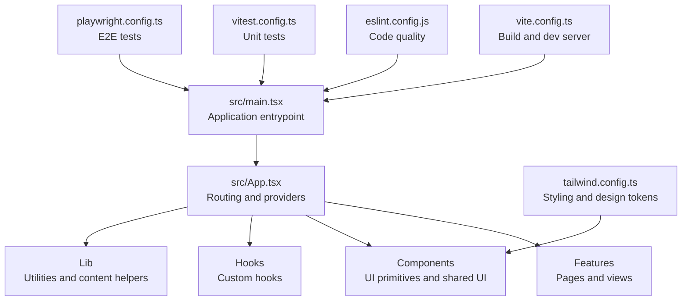
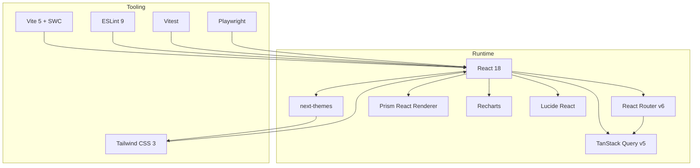
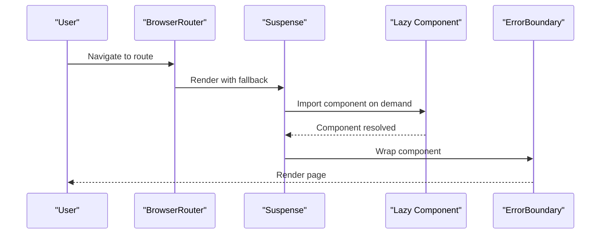
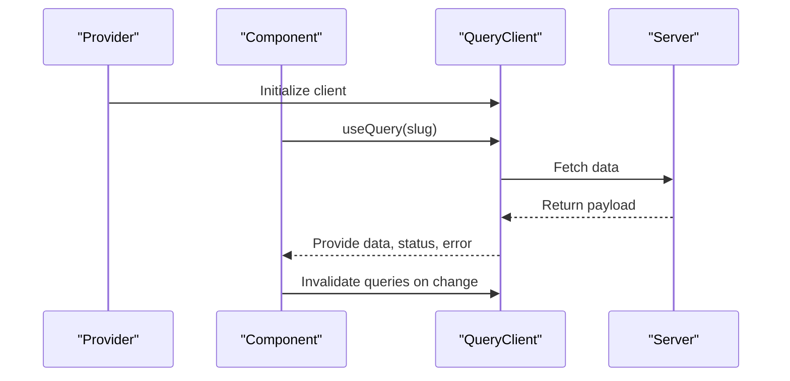
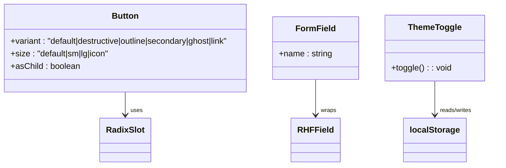
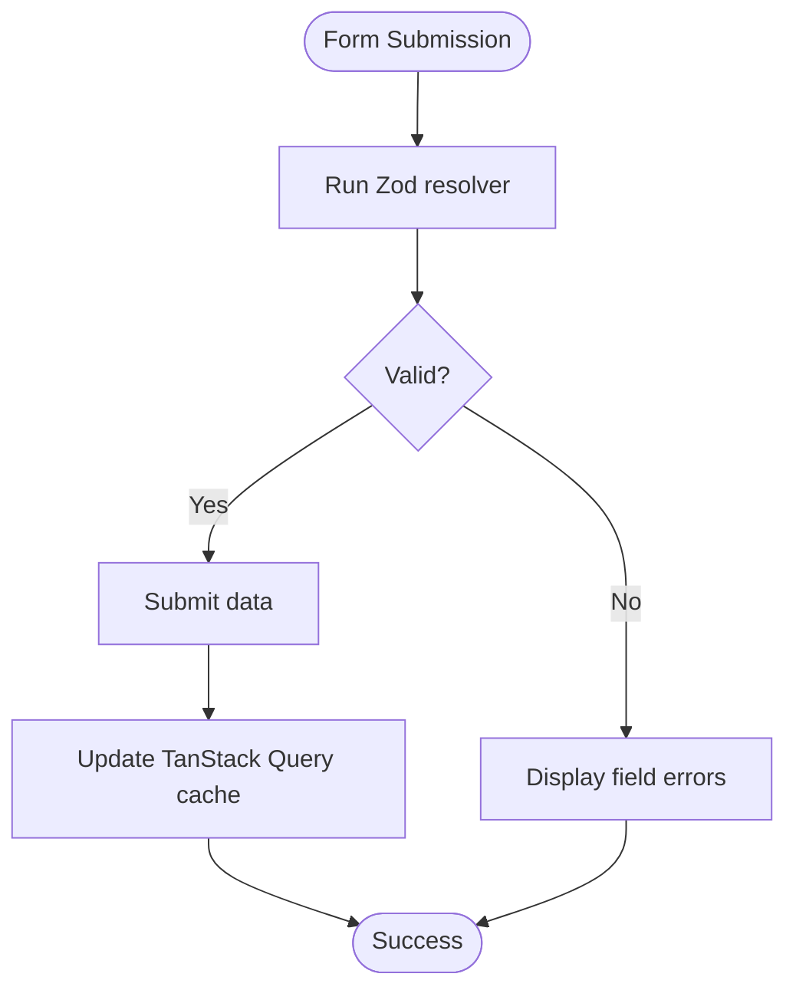
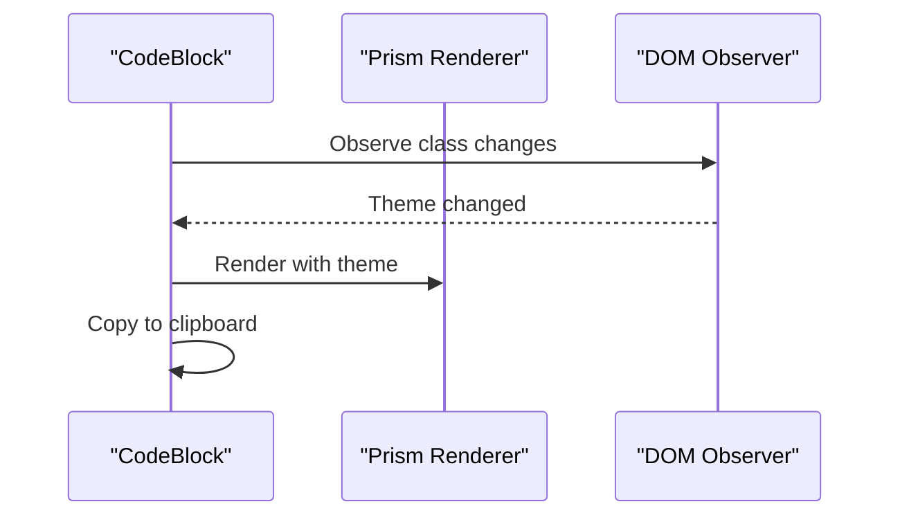
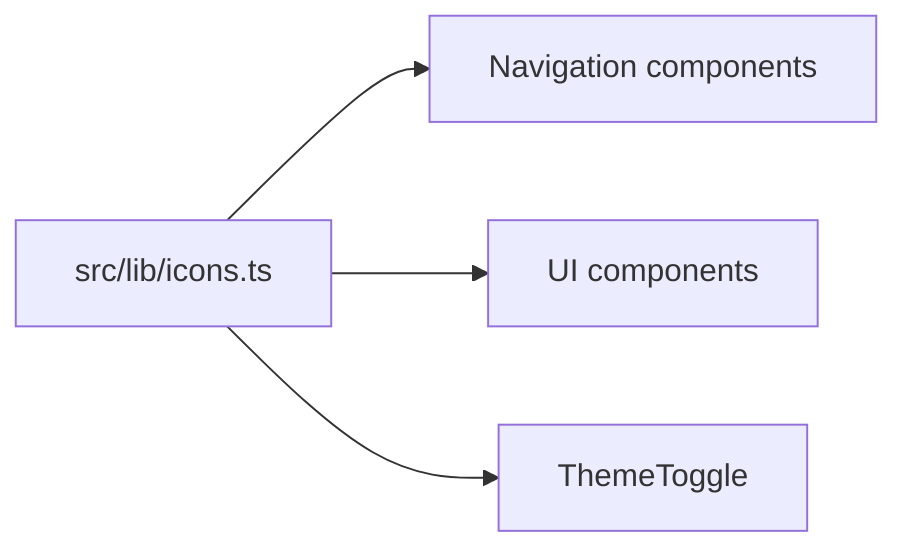
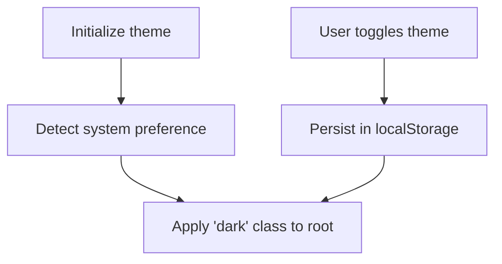
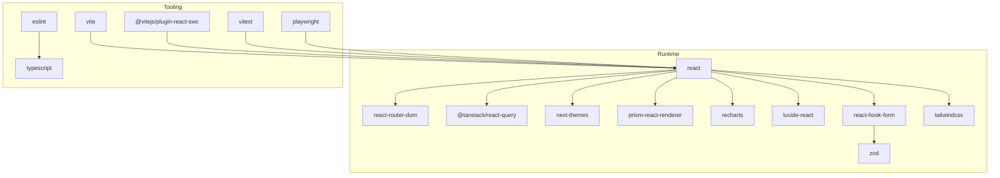

# Technology Stack & Dependencies

<cite>
**Referenced Files in This Document**
- [package.json](file://package.json)
- [vite.config.ts](file://vite.config.ts)
- [tailwind.config.ts](file://tailwind.config.ts)
- [eslint.config.js](file://eslint.config.js)
- [vitest.config.ts](file://vitest.config.ts)
- [playwright.config.ts](file://playwright.config.ts)
- [components.json](file://components.json)
- [src/main.tsx](file://src/main.tsx)
- [src/App.tsx](file://src/App.tsx)
- [src/lib/icons.ts](file://src/lib/icons.ts)
- [src/hooks/use-toast.ts](file://src/hooks/use-toast.ts)
- [src/components/shared/ThemeToggle.tsx](file://src/components/shared/ThemeToggle.tsx)
- [src/components/ui/button.tsx](file://src/components/ui/button.tsx)
- [src/components/ui/form.tsx](file://src/components/ui/form.tsx)
- [src/components/code/CodeBlock.tsx](file://src/components/code/CodeBlock.tsx)
- [src/features/learn/LessonPage.tsx](file://src/features/learn/LessonPage.tsx)
</cite>

## Table of Contents
1. [Introduction](#introduction)
2. [Project Structure](#project-structure)
3. [Core Components](#core-components)
4. [Architecture Overview](#architecture-overview)
5. [Detailed Component Analysis](#detailed-component-analysis)
6. [Dependency Analysis](#dependency-analysis)
7. [Performance Considerations](#performance-considerations)
8. [Troubleshooting Guide](#troubleshooting-guide)
9. [Conclusion](#conclusion)

## Introduction
This document presents a comprehensive technology stack overview for JSphere, focusing on the modern, production-grade choices that prioritize speed, scalability, and developer experience. The stack centers on React 18 with TypeScript 5 for robust UI development and type safety, Vite 5 powered by SWC for ultra-fast builds and hot module replacement (HMR), and Tailwind CSS 3 for utility-first styling with custom design tokens. The UI system leverages shadcn/ui and Radix UI primitives for accessible, composable components, while React Router v6 enables client-side routing with lazy loading. Async state management is handled by TanStack Query v5, and form handling plus schema validation use React Hook Form with Zod. Syntax highlighting is implemented via Prism React Renderer, data visualization with Recharts, and a consistent icon system with Lucide React. Dark/light mode is supported through next-themes. Testing spans unit tests with Vitest and Testing Library, and end-to-end tests with Playwright. Code quality is enforced by ESLint 9.

## Project Structure
The project follows a feature-based organization with a clear separation of concerns:
- Application bootstrap and routing in the root components
- Feature-specific pages under dedicated folders
- UI primitives and shared components organized by domain
- Content-driven pages leveraging dynamic imports and lazy loading
- Tooling configurations for build, styling, linting, testing, and e2e

**Diagram sources**
- [src/main.tsx:1-6](file://src/main.tsx#L1-L6)
- [src/App.tsx:1-103](file://src/App.tsx#L1-L103)
- [vite.config.ts:1-35](file://vite.config.ts#L1-L35)
- [tailwind.config.ts:1-104](file://tailwind.config.ts#L1-L104)
- [eslint.config.js:1-27](file://eslint.config.js#L1-L27)
- [vitest.config.ts:1-18](file://vitest.config.ts#L1-L18)
- [playwright.config.ts:1-25](file://playwright.config.ts#L1-L25)

**Section sources**
- [src/main.tsx:1-6](file://src/main.tsx#L1-L6)
- [src/App.tsx:1-103](file://src/App.tsx#L1-L103)
- [vite.config.ts:1-35](file://vite.config.ts#L1-L35)
- [tailwind.config.ts:1-104](file://tailwind.config.ts#L1-L104)
- [eslint.config.js:1-27](file://eslint.config.js#L1-L27)
- [vitest.config.ts:1-18](file://vitest.config.ts#L1-L18)
- [playwright.config.ts:1-25](file://playwright.config.ts#L1-L25)

## Core Components
This section outlines the foundational technologies and their roles in the stack.

- React 18 + TypeScript 5
  - Provides concurrent rendering, automatic batching, and strict type safety across the application.
  - Ensures predictable UI updates and improved developer productivity through compile-time checks.

- Vite 5 + SWC
  - Lightning-fast dev server with optimized HMR and efficient bundling.
  - SWC accelerates transpilation and transforms, reducing build times significantly.

- Tailwind CSS 3
  - Utility-first CSS framework with custom design tokens and dark mode support.
  - Enables rapid iteration and consistent styling across components.

- shadcn/ui + Radix UI
  - Accessible, composable UI primitives built on Radix primitives.
  - Offers a cohesive design system with consistent APIs and customization via Tailwind.

- React Router v6
  - Declarative routing with lazy loading and suspense integration.
  - Supports nested routes and dynamic parameters for content-heavy documentation sites.

- TanStack Query v5
  - Reactive data fetching, caching, and synchronization with automatic background updates.
  - Simplifies server state management and improves UX with optimistic updates.

- React Hook Form + Zod
  - Performant form handling with schema-driven validation.
  - Integrates seamlessly with UI components and provides strong typing for form data.

- Prism React Renderer
  - Syntax highlighting for code blocks with theme-aware rendering.
  - Enhances readability and educational content presentation.

- Recharts
  - Declarative charting library for data visualization.
  - Complements content-driven pages with insightful data displays.

- Lucide React
  - Consistent, minimalist icon system integrated across navigation and UI.
  - Reduces bundle size and ensures visual coherence.

- next-themes
  - Robust dark/light mode management with system preference detection.
  - Persists user preferences and supports smooth transitions.

- Vitest + Testing Library
  - Fast unit testing with native ESM support and jsdom environment.
  - Encourages writing maintainable tests close to component logic.

- Playwright
  - Reliable end-to-end testing with parallel execution and device emulation.
  - Validates real user workflows across browsers.

- ESLint 9
  - Modern linting with TypeScript and React-specific rulesets.
  - Enforces code quality, consistency, and best practices.

**Section sources**
- [package.json:22-74](file://package.json#L22-L74)
- [package.json:75-97](file://package.json#L75-L97)
- [vite.config.ts:1-35](file://vite.config.ts#L1-L35)
- [tailwind.config.ts:1-104](file://tailwind.config.ts#L1-L104)
- [eslint.config.js:1-27](file://eslint.config.js#L1-L27)
- [vitest.config.ts:1-18](file://vitest.config.ts#L1-L18)
- [playwright.config.ts:1-25](file://playwright.config.ts#L1-L25)

## Architecture Overview
The runtime architecture integrates routing, state management, and UI composition with performance-focused tooling.

**Diagram sources**
- [src/App.tsx:1-103](file://src/App.tsx#L1-L103)
- [vite.config.ts:1-35](file://vite.config.ts#L1-L35)
- [tailwind.config.ts:1-104](file://tailwind.config.ts#L1-L104)
- [eslint.config.js:1-27](file://eslint.config.js#L1-L27)
- [vitest.config.ts:1-18](file://vitest.config.ts#L1-L18)
- [playwright.config.ts:1-25](file://playwright.config.ts#L1-L25)

## Detailed Component Analysis

### Routing and Lazy Loading
The application uses React Router v6 with lazy-loaded routes and Suspense-based fallbacks to optimize initial load and improve perceived performance.

**Diagram sources**
- [src/App.tsx:10-24](file://src/App.tsx#L10-L24)
- [src/App.tsx:70-91](file://src/App.tsx#L70-L91)

**Section sources**
- [src/App.tsx:10-24](file://src/App.tsx#L10-L24)
- [src/App.tsx:70-91](file://src/App.tsx#L70-L91)

### Async State Management with TanStack Query
TanStack Query v5 centralizes data fetching, caching, and synchronization. The app initializes a QueryClient provider at the root and uses hooks to manage server state.

**Diagram sources**
- [src/App.tsx:25](file://src/App.tsx#L25)
- [src/features/learn/LessonPage.tsx:23](file://src/features/learn/LessonPage.tsx#L23)

**Section sources**
- [src/App.tsx:25](file://src/App.tsx#L25)
- [src/features/learn/LessonPage.tsx:23](file://src/features/learn/LessonPage.tsx#L23)

### UI Primitives and Theming
shadcn/ui components are built on Radix UI primitives and styled with Tailwind. Variants and sizes are standardized via class composition utilities, and theming is managed globally with next-themes.

**Diagram sources**
- [src/components/ui/button.tsx:1-48](file://src/components/ui/button.tsx#L1-L48)
- [src/components/ui/form.tsx:1-130](file://src/components/ui/form.tsx#L1-L130)
- [src/components/shared/ThemeToggle.tsx:1-30](file://src/components/shared/ThemeToggle.tsx#L1-L30)

**Section sources**
- [src/components/ui/button.tsx:1-48](file://src/components/ui/button.tsx#L1-L48)
- [src/components/ui/form.tsx:1-130](file://src/components/ui/form.tsx#L1-L130)
- [src/components/shared/ThemeToggle.tsx:1-30](file://src/components/shared/ThemeToggle.tsx#L1-L30)

### Form Handling and Validation
Forms leverage React Hook Form with Zod resolvers for schema-driven validation. The Form component composes Radix UI primitives and integrates with UI components for accessible labeling and error reporting.

**Diagram sources**
- [src/components/ui/form.tsx:1-130](file://src/components/ui/form.tsx#L1-L130)
- [package.json:23](file://package.json#L23)
- [package.json:65-73](file://package.json#L65-L73)

**Section sources**
- [src/components/ui/form.tsx:1-130](file://src/components/ui/form.tsx#L1-L130)
- [package.json:23](file://package.json#L23)
- [package.json:65-73](file://package.json#L65-L73)

### Syntax Highlighting and Code Presentation
Code blocks use Prism React Renderer with theme-aware selection and interactive copy functionality. The component observes theme changes and adapts accordingly.

**Diagram sources**
- [src/components/code/CodeBlock.tsx:1-106](file://src/components/code/CodeBlock.tsx#L1-L106)

**Section sources**
- [src/components/code/CodeBlock.tsx:1-106](file://src/components/code/CodeBlock.tsx#L1-L106)

### Icon System and Navigation
Lucide React provides a consistent icon set used across navigation and UI elements. A centralized mapping ensures maintainability and extensibility.

**Diagram sources**
- [src/lib/icons.ts:1-33](file://src/lib/icons.ts#L1-L33)

**Section sources**
- [src/lib/icons.ts:1-33](file://src/lib/icons.ts#L1-L33)

### Dark/Light Mode Implementation
next-themes manages theme persistence and system preference detection. ThemeToggle toggles the theme and persists user choice.

**Diagram sources**
- [src/components/shared/ThemeToggle.tsx:1-30](file://src/components/shared/ThemeToggle.tsx#L1-L30)

**Section sources**
- [src/components/shared/ThemeToggle.tsx:1-30](file://src/components/shared/ThemeToggle.tsx#L1-L30)

## Dependency Analysis
The dependency graph highlights core libraries and their relationships.

**Diagram sources**
- [package.json:22-74](file://package.json#L22-L74)
- [package.json:75-97](file://package.json#L75-L97)

**Section sources**
- [package.json:22-74](file://package.json#L22-L74)
- [package.json:75-97](file://package.json#L75-L97)

## Performance Considerations
- Build and Dev Experience
  - Vite 5 with SWC delivers near-instant cold starts and lightning-fast HMR during development.
  - Manual chunking separates vendor bundles, UI primitives, and query-related code for optimal caching and parallel loading.

- Rendering and Routing
  - Lazy loading with Suspense avoids blocking the main thread and reduces initial bundle size.
  - Concurrent features in React 18 enable prioritization of user interactions.

- Styling and Theming
  - Tailwind’s JIT and CSS variable-based tokens minimize runtime overhead and enable efficient theme switching.
  - next-themes avoids layout shifts by applying classes at the root level.

- Data Fetching
  - TanStack Query’s caching and background updates prevent redundant network requests and keep the UI responsive.
  - Optimistic updates and invalidation strategies reduce perceived latency.

- Testing
  - Vitest’s lightweight runner and jsdom environment accelerate unit tests.
  - Playwright’s parallel execution and device emulation ensure reliable e2e coverage without slowing down CI.

**Section sources**
- [vite.config.ts:22-33](file://vite.config.ts#L22-L33)
- [src/App.tsx:10-24](file://src/App.tsx#L10-L24)
- [tailwind.config.ts:1-104](file://tailwind.config.ts#L1-L104)
- [src/components/shared/ThemeToggle.tsx:1-30](file://src/components/shared/ThemeToggle.tsx#L1-L30)
- [src/hooks/use-toast.ts:1-187](file://src/hooks/use-toast.ts#L1-L187)

## Troubleshooting Guide
- Build and Dev Server
  - If HMR overlays are distracting, disable the overlay in the dev server configuration.
  - Deduplication of React packages prevents version conflicts and reduces bundle size.

- Styling Issues
  - Ensure Tailwind’s content paths include all component directories to purge unused styles.
  - Verify CSS variables for theme tokens are present in the root element when using next-themes.

- Testing
  - Unit tests run in jsdom; ensure setup files initialize required providers (e.g., QueryClient, Theme).
  - E2E tests rely on a local dev server; confirm the web server command and base URL align with Playwright configuration.

- Forms and Validation
  - When integrating with UI components, ensure labels and error messages are bound to the correct field IDs.
  - Use Zod resolvers to enforce schema validation and surface precise error messages.

**Section sources**
- [vite.config.ts:8-14](file://vite.config.ts#L8-L14)
- [vite.config.ts:16-21](file://vite.config.ts#L16-L21)
- [tailwind.config.ts:4-6](file://tailwind.config.ts#L4-L6)
- [vitest.config.ts:7-13](file://vitest.config.ts#L7-L13)
- [playwright.config.ts:18-23](file://playwright.config.ts#L18-L23)
- [src/components/ui/form.tsx:75-99](file://src/components/ui/form.tsx#L75-L99)

## Conclusion
JSphere’s technology stack combines modern tooling and libraries to deliver a fast, scalable, and developer-friendly experience. React 18 and TypeScript 5 provide a solid foundation, while Vite 5 with SWC optimizes build performance. Tailwind CSS 3 and shadcn/ui enable rapid, consistent UI development. TanStack Query simplifies async state, and React Hook Form with Zod ensures robust forms. Prism React Renderer, Recharts, and Lucide React elevate content presentation and usability. next-themes, Vitest, Playwright, and ESLint 9 round out the ecosystem with strong theming, testing, and code quality practices. Together, these technologies form a cohesive, production-grade stack tailored for speed, scalability, and developer satisfaction.