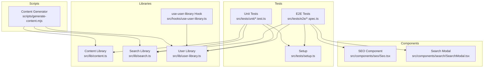
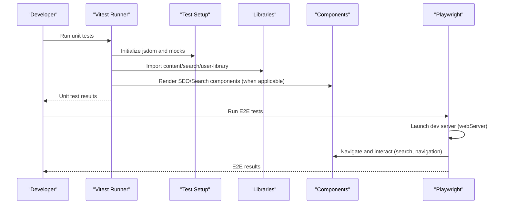
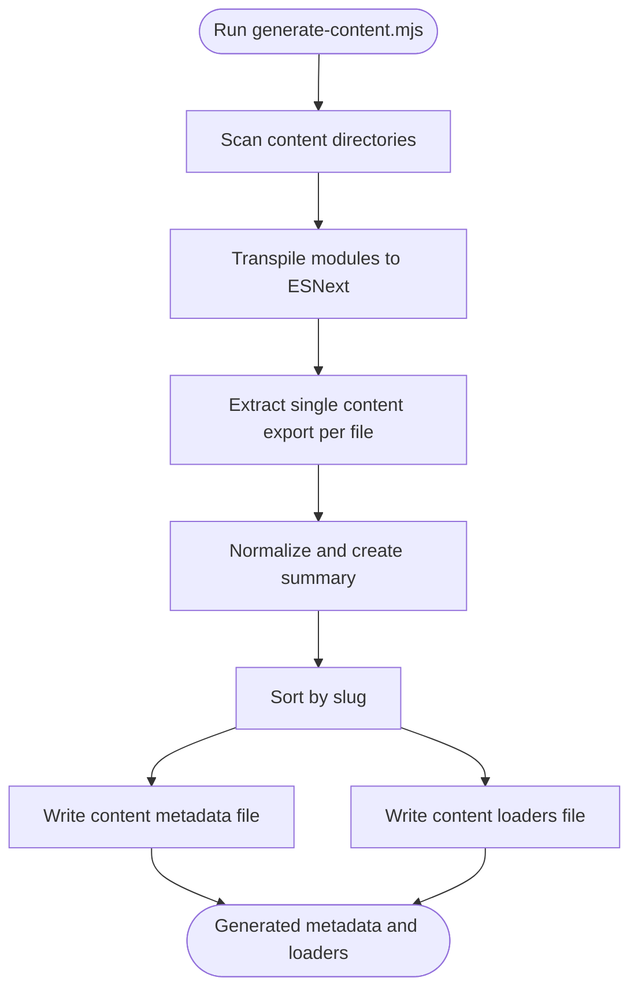
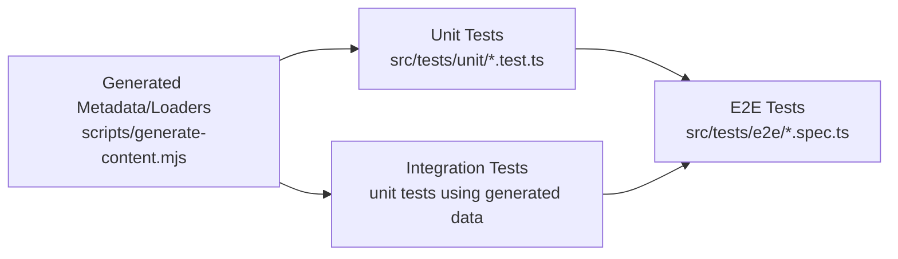
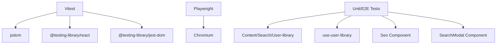

# Testing Strategy

<cite>
**Referenced Files in This Document**
- [package.json](file://package.json)
- [vitest.config.ts](file://vitest.config.ts)
- [playwright.config.ts](file://playwright.config.ts)
- [src/tests/setup.ts](file://src/tests/setup.ts)
- [src/tests/unit/content-integrity.test.ts](file://src/tests/unit/content-integrity.test.ts)
- [src/tests/unit/search.test.ts](file://src/tests/unit/search.test.ts)
- [src/tests/unit/seo.test.tsx](file://src/tests/unit/seo.test.tsx)
- [src/tests/unit/user-library.test.ts](file://src/tests/unit/user-library.test.ts)
- [src/tests/e2e/smoke.spec.ts](file://src/tests/e2e/smoke.spec.ts)
- [scripts/generate-content.mjs](file://scripts/generate-content.mjs)
- [src/lib/content.ts](file://src/lib/content.ts)
- [src/lib/search.ts](file://src/lib/search.ts)
- [src/lib/user-library.ts](file://src/lib/user-library.ts)
- [src/hooks/use-user-library.ts](file://src/hooks/use-user-library.ts)
- [src/components/seo/Seo.tsx](file://src/components/seo/Seo.tsx)
- [src/components/search/SearchModal.tsx](file://src/components/search/SearchModal.tsx)
</cite>

## Table of Contents
1. [Introduction](#introduction)
2. [Project Structure](#project-structure)
3. [Core Components](#core-components)
4. [Architecture Overview](#architecture-overview)
5. [Detailed Component Analysis](#detailed-component-analysis)
6. [Dependency Analysis](#dependency-analysis)
7. [Performance Considerations](#performance-considerations)
8. [Troubleshooting Guide](#troubleshooting-guide)
9. [Conclusion](#conclusion)
10. [Appendices](#appendices)

## Introduction
This document defines a comprehensive testing strategy for JSphere using a three-layer approach:
- Unit tests with Vitest and Testing Library validate content integrity, search logic, SEO metadata, and user library functionality.
- Integration tests validate interactions between libraries and generated content.
- End-to-end tests with Playwright ensure critical user journeys across the application.

It also documents watch mode workflows, setup and configuration files, best practices for React components and custom hooks, and the content generation pipeline that guarantees metadata integrity.

## Project Structure
The testing stack is organized under src/tests with unit and e2e folders, and a shared setup file. Scripts drive content generation that feeds into unit and integration tests.

**Diagram sources**
- [src/tests/unit/content-integrity.test.ts:1-107](file://src/tests/unit/content-integrity.test.ts#L1-L107)
- [src/tests/unit/search.test.ts:1-59](file://src/tests/unit/search.test.ts#L1-L59)
- [src/tests/unit/seo.test.tsx:1-23](file://src/tests/unit/seo.test.tsx#L1-L23)
- [src/tests/unit/user-library.test.ts:1-46](file://src/tests/unit/user-library.test.ts#L1-L46)
- [src/tests/e2e/smoke.spec.ts:1-81](file://src/tests/e2e/smoke.spec.ts#L1-L81)
- [src/tests/setup.ts:1-56](file://src/tests/setup.ts#L1-L56)
- [src/lib/content.ts:1-126](file://src/lib/content.ts#L1-L126)
- [src/lib/search.ts:1-127](file://src/lib/search.ts#L1-L127)
- [src/lib/user-library.ts:1-213](file://src/lib/user-library.ts#L1-L213)
- [src/hooks/use-user-library.ts:1-7](file://src/hooks/use-user-library.ts#L1-L7)
- [src/components/seo/Seo.tsx:1-33](file://src/components/seo/Seo.tsx#L1-L33)
- [src/components/search/SearchModal.tsx:1-154](file://src/components/search/SearchModal.tsx#L1-L154)
- [scripts/generate-content.mjs:1-158](file://scripts/generate-content.mjs#L1-L158)

**Section sources**
- [package.json:6-21](file://package.json#L6-L21)
- [vitest.config.ts:1-18](file://vitest.config.ts#L1-L18)
- [playwright.config.ts:1-25](file://playwright.config.ts#L1-L25)
- [src/tests/setup.ts:1-56](file://src/tests/setup.ts#L1-L56)

## Core Components
- Unit tests validate:
  - Content integrity against generated metadata and loaders.
  - Search ranking and grouping logic.
  - SEO meta tag updates via react-helmet-async.
  - User library persistence, deduplication, and progress semantics.
- Integration tests leverage the content generation pipeline to ensure metadata integrity and loader correctness.
- E2E tests cover critical journeys: app loading, navigation, search modal behavior, content rendering, and user library persistence.

**Section sources**
- [src/tests/unit/content-integrity.test.ts:1-107](file://src/tests/unit/content-integrity.test.ts#L1-L107)
- [src/tests/unit/search.test.ts:1-59](file://src/tests/unit/search.test.ts#L1-L59)
- [src/tests/unit/seo.test.tsx:1-23](file://src/tests/unit/seo.test.tsx#L1-L23)
- [src/tests/unit/user-library.test.ts:1-46](file://src/tests/unit/user-library.test.ts#L1-L46)
- [src/tests/e2e/smoke.spec.ts:1-81](file://src/tests/e2e/smoke.spec.ts#L1-L81)
- [scripts/generate-content.mjs:93-152](file://scripts/generate-content.mjs#L93-L152)

## Architecture Overview
The testing architecture integrates three layers:
- Unit layer: isolated logic tests for content, search, and user library.
- Integration layer: tests that depend on generated metadata and loaders.
- E2E layer: Playwright tests validating real user flows.

**Diagram sources**
- [vitest.config.ts:7-13](file://vitest.config.ts#L7-L13)
- [playwright.config.ts:18-23](file://playwright.config.ts#L18-L23)
- [src/tests/setup.ts:1-56](file://src/tests/setup.ts#L1-L56)
- [src/components/seo/Seo.tsx:1-33](file://src/components/seo/Seo.tsx#L1-L33)
- [src/components/search/SearchModal.tsx:1-154](file://src/components/search/SearchModal.tsx#L1-L154)

## Detailed Component Analysis

### Unit Testing Strategy
- Environment and setup:
  - jsdom environment with global helpers and DOM assertions.
  - Custom localStorage mock and matchMedia polyfill to avoid SSR/SSR mismatch.
  - Automatic cleanup of document head and title after each test.
- Test categories:
  - Content integrity: validates allowed pillars/types, uniqueness of ids/slugs, related topic references, loader-to-metadata parity, non-empty code blocks, navigation availability, and prev/next integrity.
  - Search logic: verifies exact title preference, alias matching, and grouping by content type.
  - SEO meta tags: confirms title, description, OpenGraph URL, and canonical link updates.
  - User library: toggles bookmarks, deduplicates recent searches, tracks highest reading progress, and handles invalid storage gracefully.

Best practices:
- Prefer deterministic fixtures and controlled inputs.
- Use Testing Library’s render and waitFor for async DOM updates.
- Mock external dependencies (e.g., localStorage) via setup.
- Keep tests focused and assert observable outcomes.

**Section sources**
- [vitest.config.ts:7-13](file://vitest.config.ts#L7-L13)
- [src/tests/setup.ts:1-56](file://src/tests/setup.ts#L1-L56)
- [src/tests/unit/content-integrity.test.ts:1-107](file://src/tests/unit/content-integrity.test.ts#L1-L107)
- [src/tests/unit/search.test.ts:1-59](file://src/tests/unit/search.test.ts#L1-L59)
- [src/tests/unit/seo.test.tsx:1-23](file://src/tests/unit/seo.test.tsx#L1-L23)
- [src/tests/unit/user-library.test.ts:1-46](file://src/tests/unit/user-library.test.ts#L1-L46)

### Watch Mode and TDD Workflow
- Scripts:
  - Run unit tests in watch mode for active development and TDD.
  - Pre-test hooks regenerate content to keep metadata and loaders fresh.
- Workflow:
  - Develop a failing test, implement minimal logic, verify pass, refactor, and repeat.
  - Use watch mode to receive immediate feedback during iterative development.

**Section sources**
- [package.json:16-20](file://package.json#L16-L20)
- [vitest.config.ts:10-12](file://vitest.config.ts#L10-L12)

### End-to-End Testing Strategy
- Scope:
  - Smoke tests cover app loading, navigation, search modal opening and selection, SEO updates, bookmark persistence, disabled “coming soon” navigation, and 404 handling.
- Configuration:
  - Playwright runs tests in parallel with a single Chromium device profile.
  - Uses a local dev server launched on a fixed host/port with automatic reuse when not in CI.
  - Retries are enabled in CI for flakiness mitigation.
- Reporting:
  - List reporter for concise output; retains traces on failure for diagnostics.

**Section sources**
- [playwright.config.ts:1-25](file://playwright.config.ts#L1-L25)
- [src/tests/e2e/smoke.spec.ts:1-81](file://src/tests/e2e/smoke.spec.ts#L1-L81)

### Content Generation Pipeline and Metadata Integrity
- The generator:
  - Walks content directories, transpiles modules, extracts a single content export per file, normalizes metadata, and writes generated files.
  - Produces contentSummaries and contentLoaders consumed by libraries and tests.
- Validation:
  - Unit tests assert that loaders return entries matching metadata, ids/slugs are unique, related topics exist, and code blocks are non-empty.
  - Navigation functions rely on generated metadata to mark available routes and compute prev/next links.

**Diagram sources**
- [scripts/generate-content.mjs:23-152](file://scripts/generate-content.mjs#L23-L152)

**Section sources**
- [scripts/generate-content.mjs:93-152](file://scripts/generate-content.mjs#L93-L152)
- [src/lib/content.ts:38-42](file://src/lib/content.ts#L38-L42)
- [src/tests/unit/content-integrity.test.ts:49-57](file://src/tests/unit/content-integrity.test.ts#L49-L57)

### Integration Between Unit, Integration, and E2E Tests
- Unit tests depend on generated metadata and loaders to validate internal logic.
- Integration tests validate that generated metadata and loaders behave as expected (e.g., loader-to-metadata parity).
- E2E tests validate user-visible flows that exercise unit-tested logic in a real browser.

**Diagram sources**
- [scripts/generate-content.mjs:115-149](file://scripts/generate-content.mjs#L115-L149)
- [src/tests/unit/content-integrity.test.ts:1-107](file://src/tests/unit/content-integrity.test.ts#L1-L107)
- [src/tests/e2e/smoke.spec.ts:1-81](file://src/tests/e2e/smoke.spec.ts#L1-L81)

## Dependency Analysis
Key dependencies and their roles in testing:
- Vitest: test runner and assertion library.
- jsdom: DOM environment for unit tests.
- @testing-library/react and jest-dom: React component testing and DOM assertions.
- Playwright: browser automation for E2E tests.
- react-helmet-async: SEO meta tag updates validated in unit tests.
- Libraries under test: content, search, user-library, and hooks.

**Diagram sources**
- [package.json:75-96](file://package.json#L75-L96)
- [vitest.config.ts:7-13](file://vitest.config.ts#L7-L13)
- [playwright.config.ts:1-25](file://playwright.config.ts#L1-L25)

**Section sources**
- [package.json:75-96](file://package.json#L75-L96)
- [src/lib/search.ts:90-113](file://src/lib/search.ts#L90-L113)
- [src/lib/user-library.ts:103-123](file://src/lib/user-library.ts#L103-L123)
- [src/hooks/use-user-library.ts:1-7](file://src/hooks/use-user-library.ts#L1-L7)
- [src/components/seo/Seo.tsx:1-33](file://src/components/seo/Seo.tsx#L1-L33)
- [src/components/search/SearchModal.tsx:1-154](file://src/components/search/SearchModal.tsx#L1-L154)

## Performance Considerations
- Prefer lightweight unit tests over heavy E2E tests for frequent checks.
- Use memoization and stable inputs in unit tests to minimize runtime.
- Keep E2E tests focused on critical paths; avoid redundant navigations.
- Reuse the dev server in Playwright when not in CI to reduce startup overhead.

[No sources needed since this section provides general guidance]

## Troubleshooting Guide
Common issues and resolutions:
- Missing DOM APIs in unit tests:
  - Ensure setup initializes localStorage and matchMedia polyfills.
- Stale metadata in tests:
  - Run pre-test scripts to regenerate content before running unit or E2E suites.
- Flaky E2E tests:
  - Increase retries in CI; inspect retained traces for failure insights.
- SEO meta tags not updating:
  - Wrap components under a HelmetProvider in unit tests and use waitFor to observe DOM changes.

**Section sources**
- [src/tests/setup.ts:29-46](file://src/tests/setup.ts#L29-L46)
- [package.json:16-20](file://package.json#L16-L20)
- [playwright.config.ts:6-11](file://playwright.config.ts#L6-L11)
- [src/tests/unit/seo.test.tsx:7-21](file://src/tests/unit/seo.test.tsx#L7-L21)

## Conclusion
JSphere’s testing strategy combines unit, integration, and E2E layers to ensure correctness and reliability. The content generation pipeline guarantees metadata integrity, while Vitest and Playwright provide fast feedback and robust user journey validation. Adopt the recommended best practices and workflows to maintain high-quality tests as the platform evolves.

[No sources needed since this section summarizes without analyzing specific files]

## Appendices

### Configuration Reference
- Vitest configuration:
  - Environment: jsdom
  - Globals enabled
  - Setup file: src/tests/setup.ts
  - Includes unit tests; excludes E2E
  - Path alias for @ resolves to src
- Playwright configuration:
  - E2E directory: src/tests/e2e
  - Parallel execution
  - Retries in CI
  - Trace retention on failure
  - Web server launched on 127.0.0.1:4173 with automatic reuse outside CI

**Section sources**
- [vitest.config.ts:5-17](file://vitest.config.ts#L5-L17)
- [playwright.config.ts:3-24](file://playwright.config.ts#L3-L24)

### Writing Effective Tests for New Features
- Unit tests:
  - Isolate logic, mock external dependencies, and assert observable outcomes.
  - Validate edge cases (empty inputs, duplicates, invalid storage).
- Integration tests:
  - Leverage generated metadata and loaders to validate end-to-end behavior.
- E2E tests:
  - Focus on critical user journeys; use realistic inputs and verify UI states.
- Best practices:
  - Keep tests deterministic and fast.
  - Use descriptive test names and group related assertions.
  - Maintain setup consistency across unit and E2E environments.

[No sources needed since this section provides general guidance]